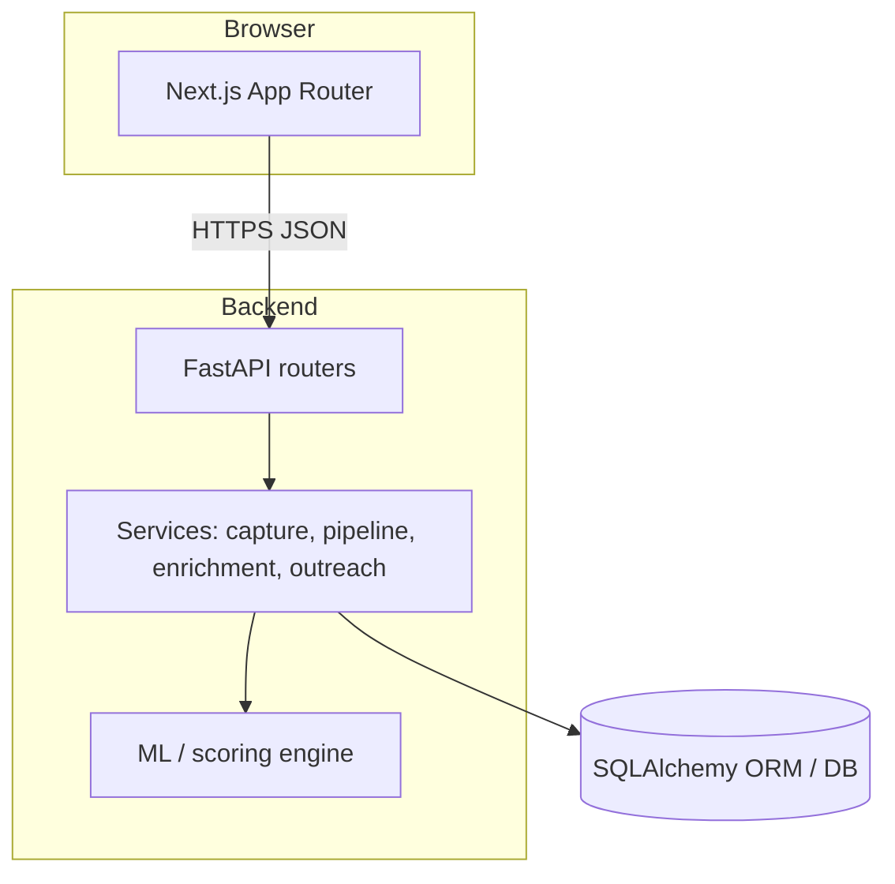
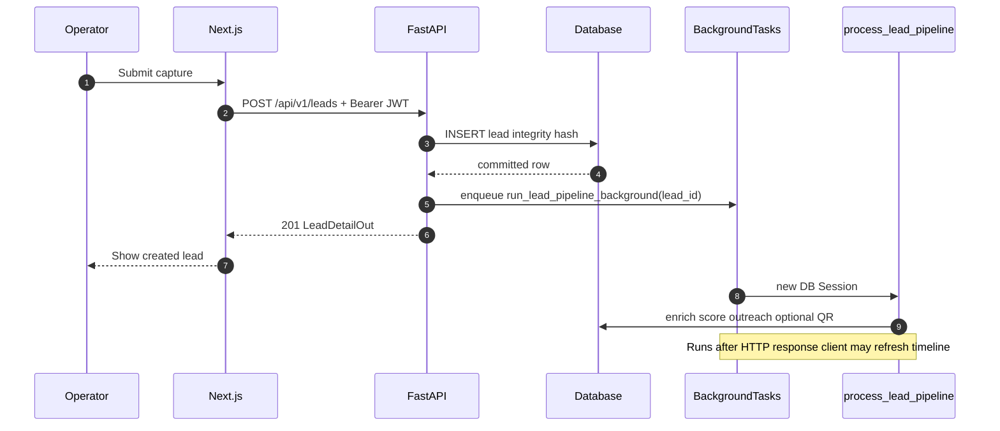
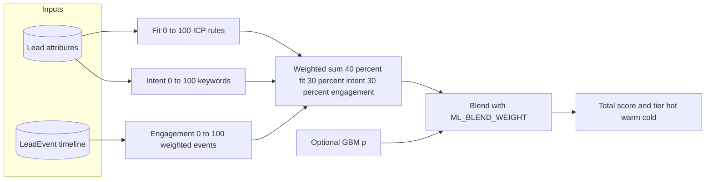
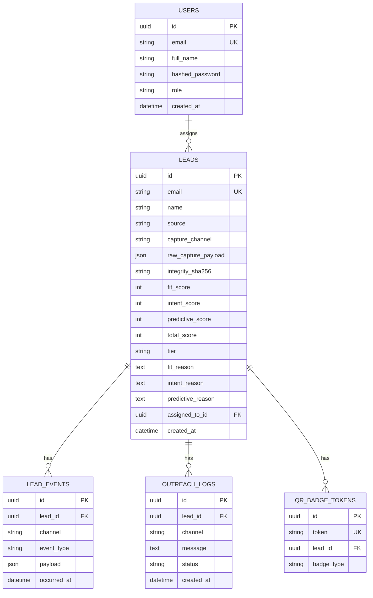
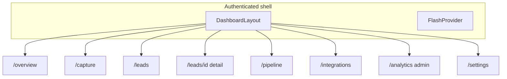
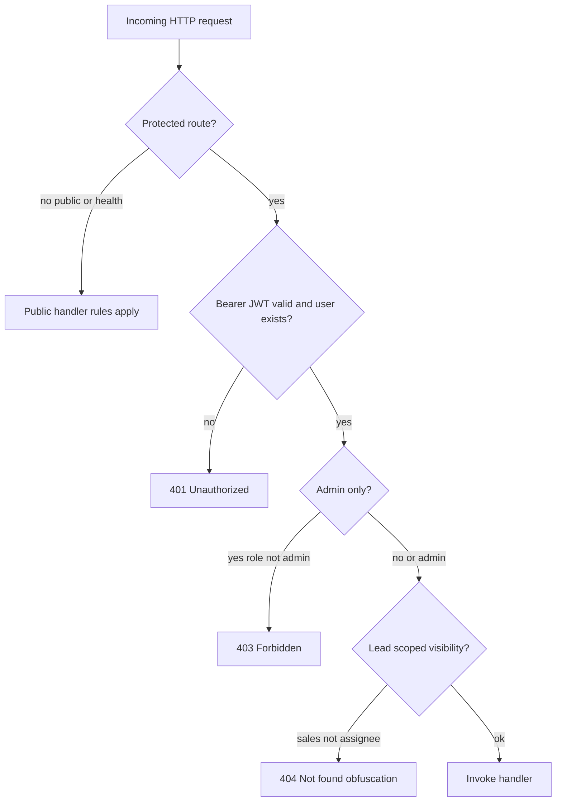

# LeadPulse: System Design Document

**Document type:** Design specification (Second Review / mid–late project stage)  
**Product:** LeadPulse — full-stack lead capture, enrichment, scoring, and outreach pipeline  
**Version:** 1.0  
**Date:** 12 April 2026  

---

## Abstract

This document specifies the system design of **LeadPulse**, a web application that ingests sales leads, normalizes and enriches contact data, assigns multi-factor scores with explainable rationales, triggers outreach workflows, and exposes operational analytics through a role-aware dashboard. The architecture follows a **client–server** pattern: a **Next.js** single-page application communicates with a **FastAPI** REST API backed by **SQLAlchemy** and **PostgreSQL** or **SQLite**. Asynchronous **background tasks** decouple HTTP latency from pipeline processing. The design emphasizes **separation of concerns** (API, services, ML scoring, persistence), **auditability** (events, outreach logs, integrity hashes), and **extensibility** (webhooks, integration status endpoints). Diagrams use Mermaid notation for portability in version control and academic submission.

**Keywords:** lead management, REST API, pipeline architecture, explainable scoring, event-sourced timeline, JWT authentication.

---

## Table of Contents

1. [Introduction and Scope](#1-introduction-and-scope)  
2. [Stakeholders and Design Goals](#2-stakeholders-and-design-goals)  
3. [Requirements](#3-requirements)  
4. [High-Level Architecture](#4-high-level-architecture)  
5. [Subsystem Design](#5-subsystem-design)  
6. [Data Model and Persistence](#6-data-model-and-persistence)  
7. [API and Integration Design](#7-api-and-integration-design)  
8. [User Interface and Information Architecture](#8-user-interface-and-information-architecture)  
9. [Security and Privacy Design](#9-security-and-privacy-design)  
10. [Non-Functional Design](#10-non-functional-design)  
11. [Design Decisions and Trade-offs](#11-design-decisions-and-trade-offs)  
12. [References](#12-references)  

---

## 1. Introduction and Scope

### 1.1 Purpose

LeadPulse addresses the problem of **fragmented lead handling**: data arrives from forms and webhooks, must be **trustworthy**, **prioritized**, and **acted on** with minimal manual overhead. This design document bounds the solution space, documents major components, and records rationale suitable for academic review and future maintenance.

### 1.2 Scope

**In scope:** authentication and authorization by role; lead CRUD and listing; webhook ingestion; post-ingest pipeline (normalization, enrichment, scoring, outreach dispatch); behavioral timeline; verification and QR-badge flows; analytics and metrics endpoints; integrations documentation surface in the UI.

**Out of scope for this design artifact:** third-party CRM synchronization beyond documented webhook URLs; production deployment topology (Kubernetes, CDN); formal legal GDPR data-processing agreements (high-level privacy considerations are noted in Section 9).

### 1.3 System Context

External actors include **marketing websites** (capture), **automation platforms** (webhooks), **email/SMS providers** (outreach channels), and **end users** (sales and admin staff). The system is deployed as two deployable units (frontend and API) sharing a database.

```mermaid
C4Context
title LeadPulse — System context (conceptual)

Person(sales, "Sales / Admin", "Uses dashboard")
System_Boundary(lp, "LeadPulse") {
  System(ui, "Web UI", "Next.js")
  System(api, "API", "FastAPI")
  SystemDb(db, "Database", "Postgres / SQLite")
}
System_Ext(site, "Capture surfaces", "Forms, ads")
System_Ext(wh, "Webhook clients", "Zapier, etc.")
System_Ext(mail, "Messaging providers", "Email / SMS")

sales --> ui
ui --> api
api --> db
site --> api
wh --> api
api --> mail
```

---

## 2. Stakeholders and Design Goals

| Stakeholder | Interest |
|-------------|----------|
| Sales representatives | Fast triage, clear scores, outreach history |
| Administrators | Analytics, user management, integration setup |
| Engineering | Maintainable layers, testable services |
| Compliance / risk | Integrity signals, verification, audit trails |

**Primary design goals:** (G1) **low-latency** capture responses with **reliable** eventual consistency for enrichment and scoring; (G2) **transparent** scoring explanations; (G3) **role-based** UI and API access; (G4) **traceability** via `lead_events` and `outreach_logs`.

---

## 3. Requirements

### 3.1 Functional Requirements

| ID | Requirement |
|----|-------------|
| FR-1 | Users authenticate; sessions use JWT-style API security. |
| FR-2 | Leads are created via API and webhooks; duplicates constrained by unique email. |
| FR-3 | Pipeline stages: normalize → enrich → score → optional outreach; timeline records ingest and behavior. |
| FR-4 | Scores include fit, intent, predictive/total components with textual reasons. |
| FR-5 | Dashboard: overview, capture, lead list/detail, pipeline Kanban, integrations, analytics (admin), settings. |
| FR-6 | Public/tracking/verify endpoints support QR and verification flows without dashboard session. |

### 3.2 Non-Functional Requirements

| ID | Requirement |
|----|-------------|
| NFR-1 | API must remain responsive under ingest load (background pipeline). |
| NFR-2 | CORS configurable for split hosting; development allows broad origins. |
| NFR-3 | Schema migrations implied by SQLAlchemy models; `create_all` on startup for dev simplicity. |

---

## 4. High-Level Architecture

The solution is a **modular monolith** API with a **BFF-like** frontend that calls versioned REST resources under `/api/v1`.



**Request path (typical capture):** HTTP → router → service → persistence → `BackgroundTasks` → `process_lead_pipeline` in a **new** DB session (isolation from request scope).

The sequence below is the **dynamic view** of that path: the client receives **201 Created** before enrichment and scoring finish, which keeps capture latency low while the pipeline runs asynchronously.



---

## 5. Subsystem Design

### 5.1 API Layer

Routers are grouped under `app.api.v1`: `auth`, `leads`, `webhooks`, `analytics`, `metrics`, `verify`, `public`, `tracking`, `users`, `integrations_status`. Each router maps to Pydantic schemas for input validation and response typing.

### 5.2 Service Layer

- **Capture / normalization:** `capture_normalize`, `lead_capture`, `standardize` — unify inbound shapes.  
- **Pipeline orchestration:** `pipeline.py`, `async_pipeline.py` — ordered steps and error logging.  
- **Enrichment:** `services/enrichment` — provider abstraction and persistence of firmographic fields.  
- **Scoring:** `ml/scoring_engine.py` — composes ICP fit, intent from metadata, engagement from events/simulation; optional GBM hook in `gbm_scorer.py`.  
- **Outreach:** `outreach_dispatch.py`, `workflows/outreach.py` — channel selection and log rows.  
- **Integrity / verification:** `integrity.py`, `verification.py`, tracking timeline builders.

### 5.3 ML and Explainability

Scoring decomposes into **interpretable** sub-scores with concatenated natural-language **reason strings** stored on the `Lead` entity (`fit_reason`, `intent_reason`, `predictive_reason`, `score_summary`), satisfying a lightweight **XAI** requirement without a separate model-interpretability service.

The diagram below is a **logical data-flow** view (not deployment): three rule-based signals combine with configurable weights; an optional **GBM** probability can blend into the published total before **tier** thresholds are applied.



---

## 6. Data Model and Persistence

### 6.1 Entity-Relationship Overview



### 6.2 Design Notes on Key Columns

- **`integrity_sha256`:** supports tamper-evident comparison of canonical capture payloads.  
- **`capture_channel`:** discriminates API vs webhook sources for analytics and debugging.  
- **`tier`:** denormalized hot/warm/cold label derived from scoring for UI and reporting.  
- **`LeadEvent`:** generalizes page views, clicks, and webhook-adjacent signals into one **timeline** query.

---

## 7. API and Integration Design

### 7.1 Versioning and Discovery

OpenAPI is exposed at `{API_V1_PREFIX}/openapi.json`, enabling **contract-first** client generation and academic reproducibility of the interface.

### 7.2 Webhooks

Inbound webhooks validate optional shared secrets (configuration-driven), map payloads to internal lead representations, enqueue pipeline work, and return **202 Accepted** semantics where appropriate to acknowledge receipt before heavy processing completes.

### 7.3 Integrations Status

A read-only **integrations status** endpoint and companion UI communicate which inbound URLs and capabilities are active, reducing misconfiguration during rollout.

---

## 8. User Interface and Information Architecture

### 8.1 Navigation Model

Primary navigation is **role-filtered** (`admin` vs `sales`): shared routes include Overview, Capture, Lead Management, Pipeline, Integrations, Settings; **Analytics** is admin-only. This mirrors backend authorization boundaries and reduces accidental exposure of aggregate metrics.

### 8.2 Key Screens (Conceptual Wireframe Level)

| Route | Purpose |
|-------|---------|
| `/overview` | KPI snapshot and entry to workflows |
| `/capture` | Manual or assisted lead intake |
| `/leads`, `/leads/[id]` | Tabular list with filters; detail workspace (score panel, enrichment, timeline, verification) |
| `/pipeline` | Kanban-style stage visualization |
| `/integrations` | Copy-field helpers for webhook URLs and environment alignment |
| `/analytics` | Funnel, gauges, source charts (admin) |
| `/settings` | Preferences and account-related UI |

Primary routes under the authenticated shell are summarized below; **Analytics** is omitted from the sales path in the UI configuration (see `navConfig` in implementation).



### 8.3 Component Architecture (Frontend)

Layout shell (`DashboardLayout`) wraps authenticated segments; **flash notifications** use a React context provider. Presentational UI primitives (`Button`, `Card`, `Badge`, `PageHeader`) promote **visual consistency** and reduce duplication in lead-specific composites (`LeadWorkspace`, `LeadsTable`, `InstantOutreachDrawer`).

---

## 9. Security and Privacy Design

Protected API calls follow the decision flow below; public QR and tracking endpoints bypass JWT but use their own token validation where configured.



- **Authentication:** Password hashing for users; JWT for API access (see implementation for token lifetimes and algorithms).  
- **Authorization:** Role checks on sensitive routes and UI gating.  
- **Public endpoints:** QR and tracking flows use **opaque tokens** (`qr_badge_tokens.token`) rather than sequential IDs to reduce enumeration risk.  
- **Transport:** HTTPS assumed in production; secrets via environment variables, not source control.  
- **Privacy:** PII (email, phone, name) stored in relational tables; enrichment adds inferred firmographics subject to organizational policy.

---

## 10. Non-Functional Design

- **Scalability:** Stateless API instances can scale horizontally; database remains the coordination point; background work should move to a **queue** (e.g. Redis/RQ) in a future iteration if throughput demands it.  
- **Observability:** Structured logging in pipeline failure paths; health endpoint for orchestrators.  
- **Maintainability:** Clear package boundaries (`api`, `services`, `models`, `schemas`, `ml`).

---

## 11. Design Decisions and Trade-offs

| Decision | Rationale | Trade-off |
|----------|-----------|-----------|
| Monolithic API | Faster iteration for academic and MVP scope | Service extraction later requires boundary discipline |
| `BackgroundTasks` | Simple deployment, no extra broker | Less durability than a message queue if process crashes mid-job |
| SQLAlchemy `create_all` on startup | Zero-migration friction in dev | Production should prefer Alembic migrations |
| Unique email on leads | Strong deduplication | Rejects legitimate shared inboxes for duplicate leads |
| Explainable string reasons | UX clarity | Longer row size; localization not yet modeled |

---

## 12. References

- Fielding, R. T. *Architectural Styles and the Design of Network-based Software Architectures* (REST).  
- FastAPI documentation: https://fastapi.tiangolo.com/  
- Next.js App Router documentation: https://nextjs.org/docs  
- SQLAlchemy 2.0 ORM documentation: https://docs.sqlalchemy.org/  
- Repository layout and runbooks: `README.md` in the LeadPulse monorepo root.

---

**End of Document 1 — Design**

*The Implementation, Testing, and Tools and Technologies documents are separate deliverables.*
