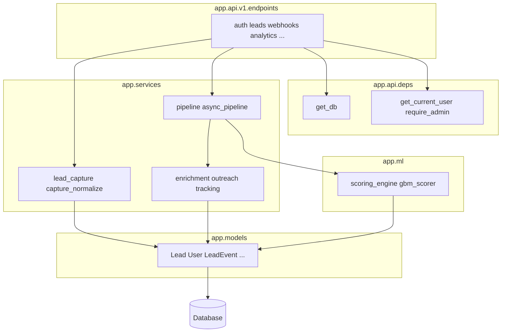
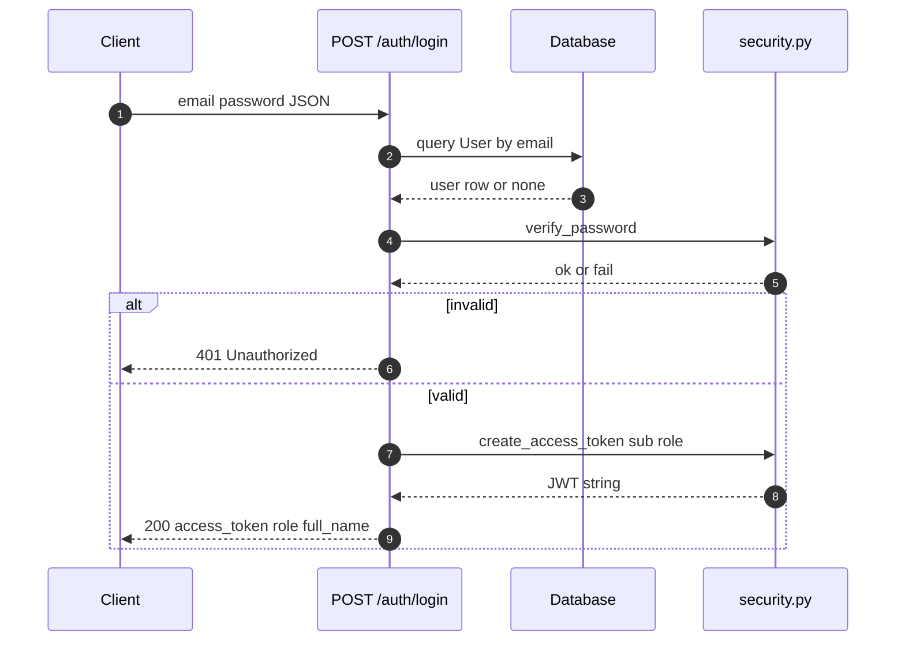
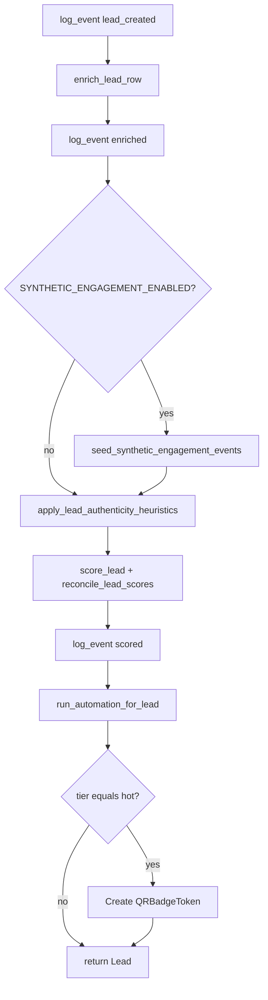
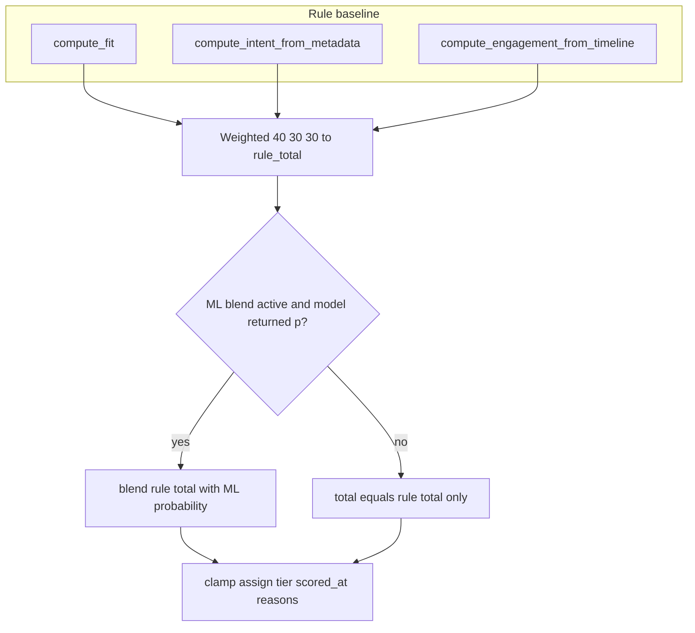
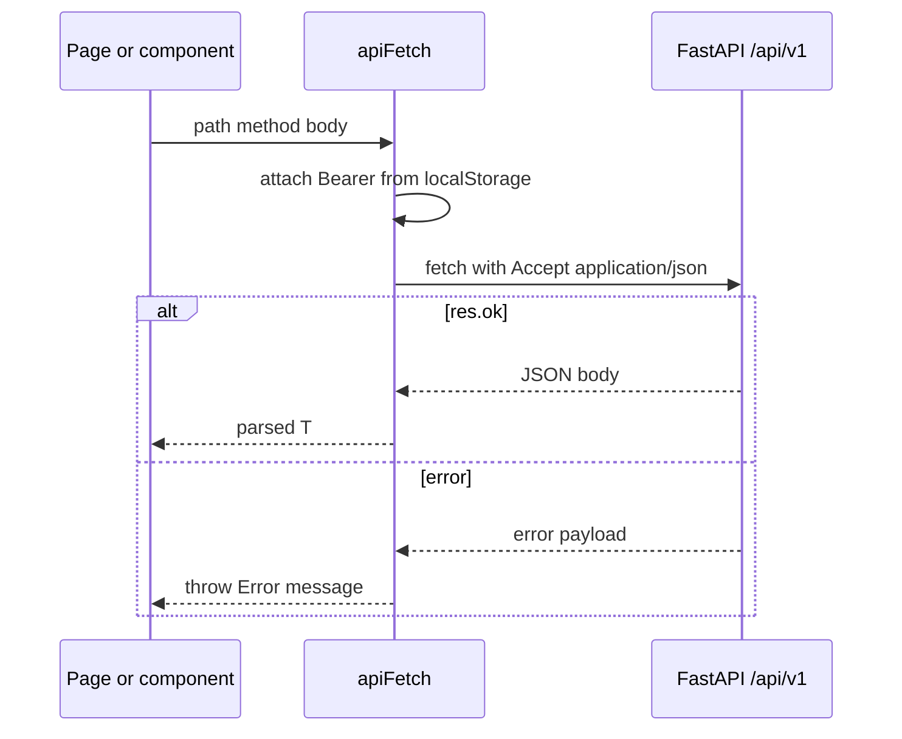

# LeadPulse: Implementation Document

**Document type:** Implementation report (Second Review / mid–late project stage)  
**Product:** LeadPulse — full-stack lead pipeline  
**Version:** 1.0  
**Date:** 12 April 2026  
**Prerequisite:** System design is documented separately in `01-Design-LeadPulse.md`.

---

## Abstract

This document describes how the LeadPulse system was **realized in code**: repository layout, backend request handling and services, the ordered **lead processing pipeline**, scoring and automation logic, and the **Next.js** client that consumes the API. Implementation follows a **layered architecture** (routers → dependencies → services → ORM models) with **Pydantic** for I/O contracts and **SQLAlchemy 2.0** for persistence. Long-running work is deferred via **FastAPI `BackgroundTasks`**, each running the pipeline in a **fresh database session** to avoid sharing request-scoped state. The text ties specific behaviors to **modules and functions** to support traceability for academic review.

**Keywords:** FastAPI, SQLAlchemy, Next.js App Router, JWT, background tasks, rule-based and blended ML scoring.

---

## Table of Contents

1. [Introduction](#1-introduction)  
2. [Repository and Build Layout](#2-repository-and-build-layout)  
3. [Backend Application Structure](#3-backend-application-structure)  
4. [Authentication and Authorization Implementation](#4-authentication-and-authorization-implementation)  
5. [Lead Capture Implementation](#5-lead-capture-implementation)  
6. [Webhook Ingestion Implementation](#6-webhook-ingestion-implementation)  
7. [Pipeline Orchestration](#7-pipeline-orchestration)  
8. [Enrichment and Standardization](#8-enrichment-and-standardization)  
9. [Scoring Engine Implementation](#9-scoring-engine-implementation)  
10. [Outreach and Automation](#10-outreach-and-automation)  
11. [Supporting Features](#11-supporting-features)  
12. [Frontend Implementation](#12-frontend-implementation)  
13. [Application Bootstrap and Lifespan](#13-application-bootstrap-and-lifespan)  
14. [Mapping Design to Code](#14-mapping-design-to-code)  
15. [Limitations and Future Work](#15-limitations-and-future-work)  
16. [References](#16-references)  

---

## 1. Introduction

The implementation delivers a **monorepo** with two runnable artifacts: `backend/` (Python) and `frontend/` (TypeScript). The backend exposes a versioned REST API; the frontend is a **server- and client-rendered** dashboard that stores the JWT in **browser `localStorage`** and attaches it to `fetch` calls. This document focuses on **algorithms and control flow** rather than line-by-line API listings (those remain in OpenAPI).

---

## 2. Repository and Build Layout

| Path | Role |
|------|------|
| `backend/app/main.py` | FastAPI app, CORS, router mount, lifespan |
| `backend/app/api/v1/` | Versioned HTTP routers |
| `backend/app/services/` | Business logic, pipelines, integrations |
| `backend/app/ml/` | Scoring helpers and optional GBM blend |
| `backend/app/models/` | SQLAlchemy ORM entities |
| `backend/app/schemas/` | Pydantic request/response models |
| `frontend/app/` | Next.js routes (App Router) |
| `frontend/components/` | UI composition |
| `frontend/lib/` | API client, auth, filters, types |

Runtime commands are documented in the root `README.md` (`uvicorn` on port 8000, `npm run dev` on port 3000).

---

## 3. Backend Application Structure

### 3.1 Entry Point and Routing

`app.main:app` constructs `FastAPI`, applies `CORSMiddleware`, and includes `api_router` under `settings.API_V1_PREFIX`. Sub-routers are registered in `app.api.v1.router` for `auth`, `leads`, `webhooks`, `analytics`, `metrics`, `verify`, `public`, `tracking`, `users`, and `integrations_status`.

### 3.2 Dependency Injection

`app.api.deps` defines:

- `get_db()` — yields a `SessionLocal()` session per request and closes it in `finally`.  
- `get_current_user()` — reads `Authorization: Bearer`, decodes JWT (`jose.jwt`), loads `User` by UUID `sub`.  
- `require_admin()` — fails with HTTP 403 unless `user.role == "admin"`.

Routers declare `Depends(get_db)` and `Depends(get_current_user)` explicitly, keeping handlers thin.

The figure below is a **UML-style package view** (implemented as Python packages, not Java packages): HTTP endpoints sit above injected dependencies; services and ML call ORM models that map to the database.



---

## 4. Authentication and Authorization Implementation

**Login:** `POST /auth/login` (`app.api.v1.endpoints.auth`) normalizes email, loads `User`, verifies password with `passlib` (`pbkdf2_sha256` via `app.core.security.verify_password`), and returns `TokenOut` containing `access_token` from `create_access_token(subject=user.id, role=user.role)` with expiry from settings.

**Token format:** JWT payload includes `sub` (user id string), `role`, and `exp`. Encoding uses `settings.JWT_SECRET` and `settings.JWT_ALGORITHM`.

**Lead visibility:** `leads.py` defines `_ensure_visible(user, lead)`: admins see all leads; sales users only see leads where `lead.assigned_to_id == user.id`. Listing applies the same filter at query construction time.



---

## 5. Lead Capture Implementation

**Service module:** `app.services.lead_capture`.

- **Email normalization:** `normalize_email` strips and lowercases.  
- **Phone normalization:** digits-only extraction; rejected if fewer than seven digits.  
- **Deduplication:** `find_duplicate_lead` queries by normalized email (matches unique DB constraint).  
- **Integrity hash:** `_canonical_capture_dict` builds a stable structure; `json.dumps(..., sort_keys=True)` feeds **SHA-256** in `compute_capture_integrity`.  
- **Audit payload:** `build_raw_capture_payload` stores `received_at` (UTC ISO), `capture_channel`, validated body, and optional `vendor_extras`.  
- **Persistence:** `create_lead` maps `LeadCaptureIn` to a `Lead` row, serializes optional `context` into `notes` as JSON string, commits, and returns the entity.

**HTTP:** `capture_lead` in `endpoints/leads.py` rejects duplicates with **409** and structured `LeadDuplicateOut`; on success enqueues `run_lead_pipeline_background(str(lead.id), "api", "rest_capture")`.

---

## 6. Webhook Ingestion Implementation

**Endpoint:** `POST /webhooks/leads` in `endpoints/webhooks.py`.

1. Optional `X-Webhook-Token` compared to `settings.WEBHOOK_SHARED_SECRET` when configured; otherwise **401**.  
2. Raw JSON body parsed; vendor-specific keys normalized through `normalize_incoming_lead_dict` into `LeadCaptureIn` plus `extras`.  
3. Optional `X-Ads-Source` header overrides `source`.  
4. Same dedupe and `IntegrityError` handling as REST capture.  
5. Background task: `run_lead_pipeline_background(..., "webhook", "webhook_received")`.

This implements **loose coupling** to external ad platforms while preserving a single internal capture shape.

---

## 7. Pipeline Orchestration

### 7.1 Background Entry

`app.services.async_pipeline.run_lead_pipeline_background` opens a **new** `SessionLocal()`, calls `process_lead_pipeline`, logs exceptions, and always `close()`s the session. This satisfies FastAPI’s requirement not to reuse the request’s DB session inside `BackgroundTasks`.

### 7.2 Ordered Steps

`app.services.pipeline.process_lead_pipeline` executes:

```text
log_event (lead_created)
→ enrich_lead_row
→ log_event (enriched)
→ [optional] seed_synthetic_engagement_events (if SYNTHETIC_ENGAGEMENT_ENABLED)
→ apply_lead_authenticity_heuristics + commit
→ score_lead + reconcile_lead_scores + commit
→ log_event (scored)
→ run_automation_for_lead
→ if tier == "hot": create QRBadgeToken (secrets.token_urlsafe) + commit
```

The same ordering is shown as an **activity-style flowchart** for quick comparison with the design document’s logical pipeline.



Each phase persists timeline rows through `app.services.tracking.timeline.log_event`, giving a **chronological audit** aligned with the design document’s event model.

---

## 8. Enrichment and Standardization

`enrich_lead_row` (`services/enrichment/service.py`) calls `providers.enrich_profile(email, name, company)` and writes firmographic fields on the lead. **Standardization** passes industry and country strings through `standardize_industry` and `standardize_country` before persistence, improving consistency for downstream ICP matching in scoring.

---

## 9. Scoring Engine Implementation

**Module:** `app.ml.scoring_engine`.

| Component | Function | Output |
|-----------|----------|--------|
| ICP fit | `compute_fit(lead)` | 0–100 + `fit_reason` text |
| Intent | `compute_intent_from_metadata(lead)` | Keyword scan over source, company, name, notes |
| Engagement | `compute_engagement_from_timeline(db, lead_id)` | Weighted sum over grouped `LeadEvent.event_type` counts (caps per type) |

**Composite rule score:**  
`rule_total = round(0.40 * fit + 0.30 * intent + 0.30 * engagement)`, clamped to `[0, 100]`.

**ML blend:** `gbm_scorer.ml_probability_and_rationale` may return a probability; if `settings.ML_BLEND_WEIGHT` is positive and ML returns a value,  
`total = round((1 - w) * rule_total + w * (100 * ml_p))`. Otherwise `total = rule_total`.

**Tier thresholds:** `hot` if `total >= HOT_SCORE_MIN`, else `warm` if `>= WARM_SCORE_MIN`, else `cold`. Reasons and `score_summary` are written to the lead row; `predictive_score` stores the engagement dimension (naming legacy in column vs. semantics).

**Incremental recompute:** `recompute_after_new_signal` reloads the lead, runs `score_lead`, applies `reconcile_lead_scores`, commits — used when authenticated clients append timeline events via `POST /leads/{id}/events`.



---

## 10. Outreach and Automation

**Module:** `app.services.workflows.outreach`.

- **`run_automation_for_lead`:** dispatches by tier — `hot` → `trigger_hot_outreach`, `warm` → `trigger_nurture_for_warm`, `cold` → `trigger_cold_bucket`.  
- **Hot path:** builds personalized subject/body (`build_personalized_email`), inserts `OutreachLog` with `status="queued"`, attempts `send_resend_email`; on missing provider config, marks `simulated` and still records success path for UX/demo. Updates `lead.first_outreach_at` on success-like outcomes; logs timeline `email_sent` / `email_failed`. Optional SMS via Twilio when `HOT_OUTREACH_SMS_ENABLED` and E.164-normalized phone exists.  
- **Warm path:** single `nurture_scheduled` log if none exists; timeline `nurture_marked`.  
- **Cold path:** timeline only (`low_priority_bucket`).

Provider-specific sending is encapsulated in `app.services.outreach_dispatch` (implementation details omitted here; see source for Resend/Twilio parameters).

---

## 11. Supporting Features

- **Assignment:** `PATCH /leads/{id}/assign` (admin-only) updates `assigned_to_id` with user existence check.  
- **Outreach history:** `GET /leads/{id}/outreach` returns descending `OutreachLog` rows.  
- **Verification artifacts:** `GET /leads/{id}/verification` computes a **display hash** from `id`, `email`, `created_at`, and lists QR paths from `QRBadgeToken` rows.  
- **Timeline listing:** `GET /leads/{id}/timeline` delegates to `list_timeline`.  
- **Filters on list:** tier (including `filter` alias), `source` ilike, score range, created date range, `limit` cap.

---

## 12. Frontend Implementation

### 12.1 Stack and Routing

The UI uses **Next.js 14** with the **App Router**. Authenticated sections live under `app/(app)/` with a shared layout wrapping `DashboardLayout` and `FlashProvider` (`app/(app)/layout.tsx`).

### 12.2 API Access

Typical client–server interaction for authenticated JSON calls:



`frontend/lib/api.ts` exports `apiFetch<T>(path, init)`:

- Prefixes requests with `API_BASE` from `config`.  
- Injects `Authorization: Bearer` from `getToken()` (`lib/auth.ts`).  
- Parses JSON errors via `parseApiErrorResponse` for user-visible messages.

### 12.3 Session Handling

`saveSession` / `clearSession` persist token, role, and display name in **`localStorage`** keys `lp_token`, `lp_role`, `lp_name`. This is appropriate for a class project or internal tool; production hardening would consider **httpOnly cookies** and CSRF strategy.

### 12.4 Role-Aware Navigation

`lib/navConfig.ts` defines `mainNav` with `roles: ["admin", "sales"]` per item; **Analytics** is admin-only at the UI layer, consistent with backend expectations.

### 12.5 Feature Modules

Lead workspace, filters, SLA cells, analytics charts, integrations copy-fields, and export helpers are implemented as React components under `components/` with types in `lib/types.ts` and mock/demo data where applicable (`lib/mockLeads.ts` for UI development).

---

## 13. Application Bootstrap and Lifespan

`lifespan` in `main.py` runs `Base.metadata.create_all(bind=engine)` then `ensure_seed_users()` so development environments have predictable login accounts. This is an **implementation convenience**; production should use migrations and external user provisioning.

---

## 14. Mapping Design to Code

| Design element | Primary implementation |
|----------------|-------------------------|
| REST versioning | `settings.API_V1_PREFIX`, `api_router` |
| RBAC | `deps.get_current_user`, `require_admin`, `_ensure_visible`, nav `roles` |
| Event timeline | `LeadEvent` model, `log_event`, `list_timeline` |
| Integrity | `compute_capture_integrity`, `integrity_sha256` on `Lead` |
| Pipeline stages | `process_lead_pipeline` ordering |
| XAI summaries | `fit_reason`, `intent_reason`, `predictive_reason`, `score_summary` |
| Hot QR badges | `QRBadgeToken` creation in pipeline |
| Split hosting | CORS `*`, `NEXT_PUBLIC_API_URL` |

---

## 15. Limitations and Future Work

- **Durability:** `BackgroundTasks` are in-process; worker loss can drop pipeline execution — a message queue would improve reliability.  
- **Migrations:** `create_all` does not evolve existing schemas safely — **Alembic** migrations are recommended.  
- **Token storage:** `localStorage` is vulnerable to XSS; mitigations include CSP, sanitization, and cookie-based sessions.  
- **Concurrency:** High duplicate-email races rely on DB uniqueness and retry logic; additional idempotency keys could be added for webhook vendors.

---

## 16. References

- LeadPulse repository `README.md` (run instructions).  
- `docs/01-Design-LeadPulse.md` (architecture and data model).  
- FastAPI documentation: https://fastapi.tiangolo.com/  
- Next.js documentation: https://nextjs.org/docs  
- SQLAlchemy ORM: https://docs.sqlalchemy.org/  

---

**End of Document 2 — Implementation**

*Document 3 (Testing) and Document 4 (Tools and Technologies) are separate deliverables.*
