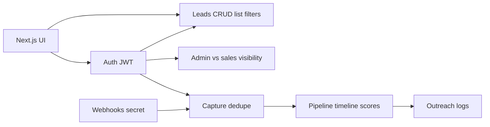
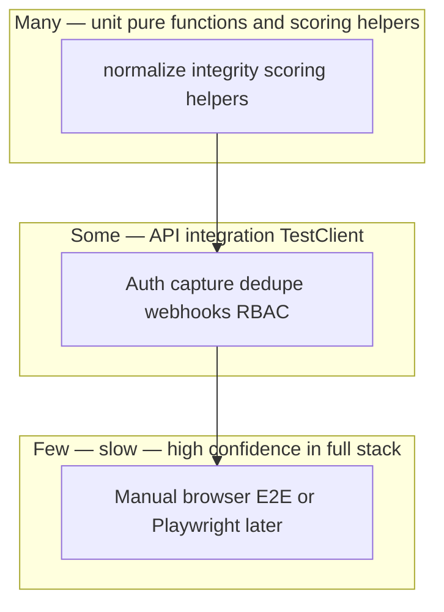

# LeadPulse: Testing Document

**Document type:** Test plan, test specification, and test report (Second Review)  
**Product:** LeadPulse  
**Version:** 1.0  
**Date:** 12 April 2026  
**Related artifacts:** `01-Design-LeadPulse.md`, `02-Implementation-LeadPulse.md`

---

## Abstract

This document defines **what** is tested for LeadPulse, **how** tests are structured by level (unit, integration, system, acceptance), and **how results** are recorded. The repository currently emphasizes **manual end-to-end verification** and **static analysis** (`next lint` on the frontend). **No automated pytest or Jest/Vitest suites** were present in the codebase at the time of this document; Section 8 records that baseline honestly and Section 9 proposes a minimal automation backlog. The test cases below are **executable specifications**: they can be run manually now or implemented later as automated checks without changing the intended behavior.

**Keywords:** test plan, test case, RBAC, API contract testing, regression, defect management, quality attributes.

---

## Table of Contents

1. [Introduction and Test Objectives](#1-introduction-and-test-objectives)  
2. [Scope and Out of Scope](#2-scope-and-out-of-scope)  
3. [Test Environment](#3-test-environment)  
4. [Test Strategy and Levels](#4-test-strategy-and-levels)  
5. [Traceability to Requirements](#5-traceability-to-requirements)  
6. [Detailed Test Cases](#6-detailed-test-cases)  
7. [Non-Functional Testing](#7-non-functional-testing)  
8. [Results and Current Evidence](#8-results-and-current-evidence)  
9. [Defects, Risks, and Follow-Up](#9-defects-risks-and-follow-up)  
10. [References](#10-references)  

---

## 1. Introduction and Test Objectives

### 1.1 Purpose

Testing validates that LeadPulse **behaves as specified** for operators (sales, admin) and external systems (webhooks), and that **security boundaries** (authentication, authorization, webhook secrets) hold under normal and adversarial misuse.

### 1.2 Objectives

| ID | Objective |
|----|-----------|
| O-1 | Confirm authenticated users can capture and view leads according to role. |
| O-2 | Confirm duplicate-email handling returns consistent **409** responses. |
| O-3 | Confirm webhook authentication rejects invalid tokens when a secret is configured. |
| O-4 | Confirm pipeline side effects: enrichment fields populated, scores in range, timeline events appended. |
| O-5 | Confirm admin-only routes reject sales users with **403**. |
| O-6 | Confirm frontend builds and lint passes without blocking errors. |

---

## 2. Scope and Out of Scope

**In scope:** REST API (`/api/v1/...`), webhook ingestion, JWT login, lead listing filters, assignment, timeline and outreach listing, health check, Next.js dashboard navigation and API wiring.

**Out of scope for this document:** load testing at production scale; formal penetration test by a third party; email/SMS **delivery** to real inboxes (provider sandboxes or mocked transports may be used).

For **regression planning**, a compact view of major test subjects and their relationships is:

---

## 3. Test Environment

| Component | Suggested configuration |
|-----------|-------------------------|
| Backend | Python 3.11+, `uvicorn app.main:app --reload`, port **8000** |
| Database | SQLite (default dev) or PostgreSQL per `DATABASE_URL` |
| Frontend | `npm run dev`, port **3000**; `NEXT_PUBLIC_API_URL=http://127.0.0.1:8000` |
| Tools | Browser (Chrome/Edge), `curl` or **HTTPie**, optional **OpenAPI** UI at `/api/v1/openapi.json` |
| Test data | Seed users from bootstrap; synthetic leads with unique emails |

**Reset:** For repeatable runs, use a fresh SQLite file or truncate tables in a disposable Postgres schema.

---

## 4. Test Strategy and Levels

### 4.1 Unit Testing (Target)

Isolated tests for pure functions and small modules with **no network** and **no real DB** (in-memory SQLite or mocked `Session`).

**Priority modules:** `lead_capture.normalize_email`, `normalize_phone`, `compute_capture_integrity`; scoring helpers in `scoring_engine`; `capture_normalize.normalize_incoming_lead_dict` error paths.

### 4.2 Integration Testing (Target)

**FastAPI `TestClient`** (`httpx`) against an app instance with **transactional** or **file-based** SQLite: full request → DB commit → assert rows and status codes.

**Priority flows:** `POST /auth/login`; `POST /api/v1/leads` with Bearer token; `GET /api/v1/leads` with filters; `POST /webhooks/leads` with/without `X-Webhook-Token`.

### 4.3 System / End-to-End Testing (Manual, Current)

Browser exercises **login → capture → lead detail → timeline** while API runs locally; verifies CORS, JSON error parsing in UI, and role-gated navigation.

The **test pyramid** below summarizes intended effort over time: many fast isolated checks at the base, fewer integration tests in the middle, and a thin layer of manual or automated UI verification at the top. LeadPulse currently emphasizes the top and lint until automated tests are added (see Section 8).

### 4.4 Static Analysis (Current)

| Artifact | Command | Pass criterion |
|----------|---------|----------------|
| Frontend ESLint | `npm run lint` (in `frontend/`) | Exit code 0; no unignored errors |

---

## 5. Traceability to Requirements

Mapping to design requirements (abbreviated from Document 1):

| Requirement | Test groups |
|-------------|-------------|
| FR-1 Authentication | TC-AUTH-01 … 03 |
| FR-2 Lead capture + dedupe | TC-LEAD-01 … 04, TC-WH-01 … 03 |
| FR-3 Pipeline + timeline | TC-PIPE-01 … 02 |
| FR-4 Scoring | TC-SCORE-01 … 02 |
| FR-5 RBAC listing / visibility | TC-RBAC-01 … 04 |
| FR-6 Public/verify (if exercised) | TC-PUB-01 (optional) |
| NFR-1 Responsiveness | TC-NFR-01 (smoke) |

---

## 6. Detailed Test Cases

### 6.1 Authentication (TC-AUTH)

| ID | Preconditions | Steps | Expected result |
|----|----------------|-------|-----------------|
| TC-AUTH-01 | Seed user exists | `POST /auth/login` with valid email/password | **200**, JSON includes `access_token`, `role`, `full_name` |
| TC-AUTH-02 | — | `POST /auth/login` with wrong password | **401**, generic invalid credentials message |
| TC-AUTH-03 | Valid token | `GET /api/v1/leads` with `Authorization: Bearer <token>` | **200**, list (possibly empty) |

### 6.2 Lead Capture and Dedupe (TC-LEAD)

| ID | Preconditions | Steps | Expected result |
|----|----------------|-------|-----------------|
| TC-LEAD-01 | Authenticated | `POST /api/v1/leads` with valid `LeadCaptureIn` body | **201**, response body includes new `id`, `email` normalized lowercase |
| TC-LEAD-02 | Same email exists | Repeat `POST` with same email (case variant) | **409**, detail explains duplicate; `existing_lead_id` present |
| TC-LEAD-03 | Lead created | Poll `GET /api/v1/leads/{id}` until enrichment/scores appear (or wait fixed delay) | `total_score` in 0–100 or null briefly then populated after pipeline; `tier` in {hot, warm, cold} when scored |
| TC-LEAD-04 | Sales user, lead assigned to another | `GET /api/v1/leads/{other_id}` | **404** (intentional non-enumeration) |

### 6.3 Webhooks (TC-WH)

| ID | Preconditions | Steps | Expected result |
|----|----------------|-------|-----------------|
| TC-WH-01 | `WEBHOOK_SHARED_SECRET` set in `.env` | `POST /webhooks/leads` without token or wrong token | **401** |
| TC-WH-02 | Valid token + minimal JSON mapping to required fields | Valid body per `normalize_incoming_lead_dict` | **201** |
| TC-WH-03 | Invalid JSON body | Non-JSON body | **422** |

### 6.4 RBAC and Admin (TC-RBAC)

| ID | Preconditions | Steps | Expected result |
|----|----------------|-------|-----------------|
| TC-RBAC-01 | Admin token | `PATCH /api/v1/leads/{id}/assign` | **200** when assignee exists |
| TC-RBAC-02 | Sales token | Same `PATCH` | **403** |
| TC-RBAC-03 | Sales token | `GET /api/v1/leads` | Only leads with `assigned_to_id == user.id` |
| TC-RBAC-04 | Admin token | `GET /api/v1/leads` | All leads |

### 6.5 Pipeline and Timeline (TC-PIPE)

| ID | Preconditions | Steps | Expected result |
|----|----------------|-------|-----------------|
| TC-PIPE-01 | New lead id | After short wait, `GET /api/v1/leads/{id}/timeline` | Events include types such as `lead_created`, `enriched`, `scored` (exact set depends on config flags) |
| TC-PIPE-02 | `SYNTHETIC_ENGAGEMENT_ENABLED=true` | Same timeline | Additional engagement-like events may appear from simulation |

### 6.6 Scoring Sanity (TC-SCORE)

| ID | Preconditions | Steps | Expected result |
|----|----------------|-------|-----------------|
| TC-SCORE-01 | Any scored lead | Inspect `fit_score`, `intent_score`, `predictive_score`, `total_score` | Each 0–100 or null; `total_score` consistent with tier thresholds in settings |
| TC-SCORE-02 | Authenticated, visible lead | `POST /api/v1/leads/{id}/events` with valid `LeadEventIn` | **200** detail; timeline has new row; scores recomputed |

### 6.7 System / UI (TC-UI)

| ID | Preconditions | Steps | Expected result |
|----|----------------|-------|-----------------|
| TC-UI-01 | Both servers running | Open `/login`, sign in | Redirect to app; session persisted (localStorage keys) |
| TC-UI-02 | Sales user | Navigate to Analytics route if exposed | Link hidden OR API returns **403** if forced |
| TC-UI-03 | Capture page | Submit capture form (if wired to API) | Success flash or list refresh; error message on duplicate |

### 6.8 Health and Build (TC-SYS)

| ID | Preconditions | Steps | Expected result |
|----|----------------|-------|-----------------|
| TC-SYS-01 | API running | `GET /health` | `{"status":"ok",...}` |
| TC-SYS-02 | Frontend repo | `npm run build` | Successful production build |
| TC-SYS-03 | Frontend repo | `npm run lint` | No blocking lint errors |

---

## 7. Non-Functional Testing

### 7.1 Security Smoke Tests

- **Token tampering:** Alter one character of JWT → protected routes return **401**.  
- **Missing Bearer:** Protected routes return **401**.  
- **Webhook secret:** As in TC-WH-01.

### 7.2 Data Integrity

- After capture, verify `integrity_sha256` is stable for identical canonical payloads (re-capture blocked by dedupe; can unit-test hash function with fixed payload).

### 7.3 Usability (Lightweight)

- Error messages from `parseApiErrorResponse` are readable on failed login or duplicate capture.

---

## 8. Results and Current Evidence

### 8.1 Automated Test Suite

At document creation time, the repository contained **no** `tests/` tree, **no** `pytest` dependency in `backend/requirements.txt`, and **no** `test` script in `frontend/package.json`. Therefore:

- **Automated unit/integration counts:** not applicable (baseline zero).  
- **Recommended next step:** add `pytest`, `httpx` TestClient harness, and `pytest.ini`; add `vitest` or `playwright` for UI smoke optional.

### 8.2 Static Analysis

**`npm run lint`** is defined and should be run in `frontend/` as part of CI or pre-submission checklist. Record pass/fail and ESLint output excerpt in the project’s test log when executed.

### 8.3 Manual System Testing

A **manual test log** (spreadsheet or appendix) should record: date, tester, build/commit hash, case IDs executed, pass/fail, screenshots for failures. For academic submission, attach one completed run covering at least TC-AUTH-01, TC-LEAD-01/02, TC-RBAC-03, TC-SYS-01.

---

## 9. Defects, Risks, and Follow-Up

### 9.1 Defect Log (Template)

| Defect ID | Date | Severity | Summary | Steps to reproduce | Status |
|-----------|------|----------|---------|--------------------|--------|
| DEF-001 | YYYY-MM-DD | Major / Minor / Trivial | | | Open / Fixed |

*No project-specific defects are asserted here; maintainers should copy rows as issues are discovered.*

### 9.2 Known Quality Risks (Test-Related)

| Risk | Mitigation |
|------|------------|
| Background pipeline races UI refresh | UI polling or “processing” state; tests use fixed sleep or event wait |
| CORS `*` in dev | Document production tightening; security test in staging |
| No regression suite | Prioritize API integration tests for auth + capture + dedupe |

### 9.3 Automation Backlog (Prioritized)

1. **pytest** + in-memory SQLite: auth login, duplicate capture, webhook 401.  
2. **Scoring fixtures:** synthetic `Lead` + `LeadEvent` rows → assert tier and bounds.  
3. **GitHub Actions** (or equivalent): `pytest`, `npm run lint`, `npm run build`.

---

## 10. References

- IEEE 829 concepts (test plan / test case terminology) — course-specific citation as required by instructor.  
- FastAPI testing: https://fastapi.tiangolo.com/tutorial/testing/  
- Next.js ESLint: https://nextjs.org/docs/app/building-your-application/configuring/eslint  
- `docs/01-Design-LeadPulse.md`, `docs/02-Implementation-LeadPulse.md`  

---

**End of Document 3 — Testing**

*Document 4 (Tools and Technologies) is a separate deliverable.*
