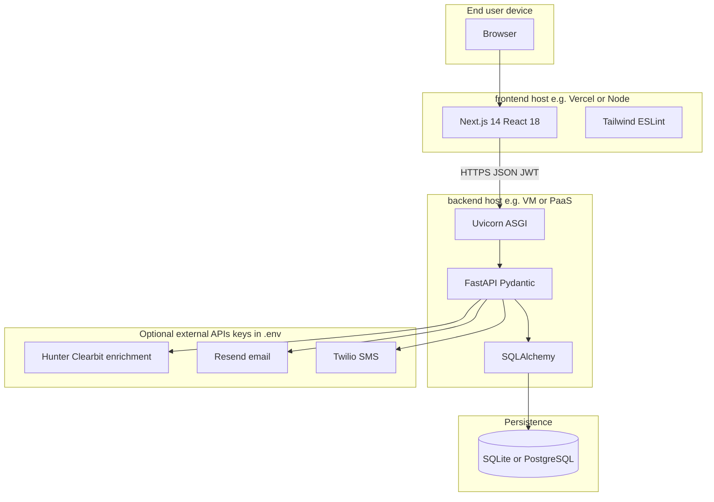

# LeadPulse: Tools and Technologies Document

**Document type:** Tools and technologies justification (Second Review)  
**Product:** LeadPulse  
**Version:** 1.0  
**Date:** 12 April 2026  
**Related artifacts:** `01-Design-LeadPulse.md`, `02-Implementation-LeadPulse.md`, `03-Testing-LeadPulse.md`

---

## Abstract

This document inventories the **languages, frameworks, libraries, databases, third-party services, and development tooling** used to build and operate LeadPulse. Each major choice is accompanied by a **short rationale** tied to project goals: rapid API development, type-safe contracts, maintainable UI, optional PostgreSQL deployment, and lightweight machine-learning blending for lead scoring. Optional integrations (enrichment, email, SMS) are listed separately because they depend on **operator-provided API keys** and may be absent in academic or offline environments.

**Keywords:** technology stack, justification, FastAPI, Next.js, SQLAlchemy, scikit-learn, DevOps.

---

## Table of Contents

1. [Introduction](#1-introduction)  
2. [Programming Languages](#2-programming-languages)  
3. [Backend Stack](#3-backend-stack)  
4. [Frontend Stack](#4-frontend-stack)  
5. [Data Persistence](#5-data-persistence)  
6. [Machine Learning and Numerics](#6-machine-learning-and-numerics)  
7. [Security and Cryptography Libraries](#7-security-and-cryptography-libraries)  
8. [Optional External Services](#8-optional-external-services)  
9. [Development and Collaboration Tooling](#9-development-and-collaboration-tooling)  
10. [Selection Criteria Summary](#10-selection-criteria-summary)  
11. [References](#11-references)  

---

## 1. Introduction

LeadPulse is implemented as a **polyglot monorepo**: Python powers the API and data layer; TypeScript/JavaScript powers the web client. This separation allows **independent deployment** (for example, static or serverless frontend with a containerized API) while keeping a single repository for coursework or small-team delivery.

The following **deployment-oriented stack diagram** complements the design document’s logical architecture: it names the main runtimes and optional third-party APIs configured through environment variables.

---

## 2. Programming Languages

| Language | Role in LeadPulse | Rationale |
|----------|-------------------|-----------|
| **Python 3.11+** (recommended) | Backend application, services, ML helpers | Mature ecosystem for web APIs (FastAPI), ORM (SQLAlchemy), and ML (scikit-learn); readable for academic review. |
| **TypeScript** | Frontend application and shared UI logic | Static typing catches integration errors early; first-class support in Next.js tooling. |
| **SQL** (dialect-specific) | Implicit via SQLAlchemy; raw SQL rare | Portable persistence; PostgreSQL features available when deployed with `psycopg2`. |
| **JSON** | REST payloads, `JSON` columns (`raw_capture_payload`, `LeadEvent.payload`) | Universal interchange format for webhooks and browser clients. |

---

## 3. Backend Stack

| Technology | Version constraint (typical) | Purpose | Justification |
|------------|------------------------------|---------|-----------------|
| [**FastAPI**](https://fastapi.tiangolo.com/) | ≥ 0.115, &lt; 1.0 | HTTP API framework | Automatic OpenAPI docs, async-capable stack, Pydantic v2 integration for validation. |
| [**Uvicorn**](https://www.uvicorn.org/) | ≥ 0.32, &lt; 1.0 | ASGI server | Standard development and production entry (`uvicorn app.main:app`). |
| [**Pydantic**](https://docs.pydantic.dev/) | v2 | Request/response models | Declarative validation and serialization; reduces boilerplate vs. manual parsing. |
| [**Pydantic Settings**](https://docs.pydantic.dev/latest/concepts/pydantic_settings/) | ≥ 2.6 | `Settings` class | Twelve-factor configuration from `.env` without ad hoc `os.environ` access. |
| [**SQLAlchemy**](https://www.sqlalchemy.org/) | 2.x ORM | Persistence layer | Explicit `Mapped[]` models; portable across SQLite and Postgres. |
| [**psycopg2-binary**](https://www.psycopg.org/) | ≥ 2.9 | PostgreSQL driver | Production-grade DB connectivity when `DATABASE_URL` targets Postgres. |
| [**email-validator**](https://pypi.org/project/email-validator/) | ≥ 2.2 | Email field validation | Hardens capture inputs used as natural keys for deduplication. |
| [**python-multipart**](https://pypi.org/project/python-multipart/) | — | Form/file parsing (if used) | Common FastAPI dependency for non-JSON uploads. |
| [**HTTPX**](https://www.python-httpx.org/) | ≥ 0.27 | HTTP client | Outbound calls (enrichment, providers); also suitable for `TestClient`-style API tests. |

---

## 4. Frontend Stack

| Technology | Version (from `package.json`) | Purpose | Justification |
|------------|-------------------------------|---------|-----------------|
| [**Next.js**](https://nextjs.org/) | 14.2.x | React framework, App Router | File-based routing, SSR/SSG options, optimized production builds. |
| [**React**](https://react.dev/) | 18.x | UI library | Component model, large ecosystem, stable skill transfer to industry. |
| [**TypeScript**](https://www.typescriptlang.org/) | 5.x | Typed JavaScript | Safer refactors when API contracts evolve. |
| [**Tailwind CSS**](https://tailwindcss.com/) | 3.4.x | Utility-first styling | Consistent spacing/typography with minimal custom CSS surface. |
| [**PostCSS**](https://postcss.org/) | 8.x | CSS pipeline | Standard Tailwind integration. |
| [**Lucide React**](https://lucide.dev/) | ^1.8 | Icon set | Lightweight SVG icons for navigation and actions. |
| [**TanStack React Virtual**](https://tanstack.com/virtual) | ^3.13 | Virtualized lists | Performance for large lead tables without full DOM materialization. |
| [**jsPDF**](https://github.com/parallax/jsPDF) + [**jspdf-autotable**](https://github.com/simonbengtsson/jsPDF-AutoTable) | ^4 / ^5 | Client-side PDF export | Reporting without a server-side renderer for class demos. |
| [**ESLint**](https://eslint.org/) + **eslint-config-next** | 8.x / aligned with Next | Static analysis | Catches common React/Next mistakes; `npm run lint` in CI. |

---

## 5. Data Persistence

| Technology | Role | Justification |
|------------|------|----------------|
| **SQLite** (`sqlite:///./leadpulse_dev.db` default) | Local development database | Zero-install persistence; suitable for laptops and grading environments. |
| **PostgreSQL** (via `DATABASE_URL`) | Optional production database | ACID, concurrency, and operational tooling superior to SQLite at scale. |
| **SQLAlchemy `create_all`** (lifespan) | Schema bootstrap | Minimizes migration friction for coursework; production teams typically add **Alembic** migrations. |

---

## 6. Machine Learning and Numerics

| Technology | Role | Justification |
|------------|------|----------------|
| [**NumPy**](https://numpy.org/) | Numerical arrays | Foundation for vectorized operations used by scikit-learn pipelines. |
| [**scikit-learn**](https://scikit-learn.org/) | GBM / probabilistic scoring helpers (`app.ml.gbm_scorer`) | Widely taught in data-science curricula; interpretable tree ensembles; no proprietary runtime. |

The primary score remains **rule-based**; ML is **blended** with configurable `ML_BLEND_WEIGHT`, allowing demonstrations to run without trained models while supporting extension.

---

## 7. Security and Cryptography Libraries

| Technology | Role | Justification |
|------------|------|----------------|
| [**Passlib**](https://passlib.readthedocs.io/) | Password hashing (`pbkdf2_sha256`) | Well-established abstraction over vetted algorithms. |
| [**python-jose**](https://github.com/mpdavis/python-jose) \[cryptography\] | JWT encode/decode | Compact session tokens for SPA + API split; `cryptography` extra uses robust backends. |

**Note:** JWTs in `localStorage` are a **convenience trade-off** for the project scope; production systems often prefer **httpOnly** cookies and stricter CSRF policies.

---

## 8. Optional External Services

These are **not** hard dependencies of the core repository; they are activated through environment variables in `app.core.config`:

| Service | Configuration keys | Role |
|---------|-------------------|------|
| [**Hunter.io**](https://hunter.io/api-documentation) | `HUNTER_API_KEY` | Email-centric firmographic enrichment (documented in settings comments). |
| **Clearbit** (style enrichment) | `CLEARBIT_API_KEY` | Optional second enrichment source. |
| **Generic enrichment HTTP** | `ENRICHMENT_API_URL`, timeout | Pluggable HTTP enrichment endpoint. |
| [**Resend**](https://resend.com/) (or compatible) | `RESEND_API_KEY`, `RESEND_FROM_EMAIL` | Transactional email for hot outreach; code path can **simulate** when unset. |
| [**Twilio**](https://www.twilio.com/) | `TWILIO_*`, `HOT_OUTREACH_SMS_ENABLED` | SMS follow-up for hot leads when phone is valid E.164. |
| **Public tracking** | `PUBLIC_TRACKING_SECRET` | Authenticates partner tracking ingest. |
| **Webhooks** | `WEBHOOK_SHARED_SECRET` | Shared-secret validation on inbound lead webhooks. |

---

## 9. Development and Collaboration Tooling

| Tool | Role |
|------|------|
| **Git** | Version control; repository may mirror **GitHub** (`leadpulse-ai` per root README). |
| **npm** | Frontend dependency install and scripts (`dev`, `build`, `lint`, `start`). |
| **pip** + **venv** | Isolated Python environment; `requirements.txt` pins major versions. |
| **Cursor / VS Code** (typical) | IDE with TypeScript and Python language servers, debugging, and Git integration. |
| **Browser DevTools** | Network tab for API inspection; Application tab for `localStorage` session keys. |
| **OpenAPI** (`/api/v1/openapi.json`) | Contract exploration and manual test scaffolding. |

---

## 10. Selection Criteria Summary

| Criterion | How the stack satisfies it |
|-----------|----------------------------|
| **Time-to-value** | FastAPI + Next.js yield working CRUD and UI quickly. |
| **Teachability** | Widespread documentation and university coursework alignment. |
| **Deployability** | Stateless API + static or Node-hosted UI; SQLite for demos, Postgres for realism. |
| **Extensibility** | Webhooks, optional ML blend, optional messaging providers. |
| **Cost for academic use** | Core stack is free/open-source; external APIs are optional. |

---

## 11. References

- LeadPulse root `README.md` — prerequisites (Node 18+, Python 3.11+), run commands.  
- `backend/requirements.txt` — authoritative Python dependency list.  
- `frontend/package.json` — authoritative frontend dependency list.  
- FastAPI: https://fastapi.tiangolo.com/  
- Next.js: https://nextjs.org/docs  
- SQLAlchemy 2.0: https://docs.sqlalchemy.org/  
- scikit-learn user guide: https://scikit-learn.org/stable/user_guide.html  

---

**End of Document 4 — Tools and Technologies**

*This completes the four-document set: Design, Implementation, Testing, and Tools and Technologies.*
