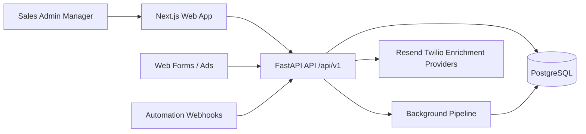
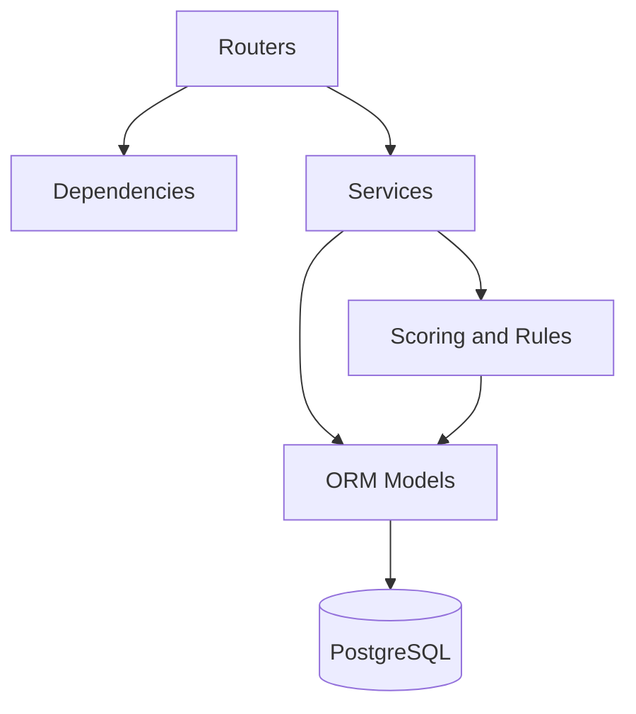
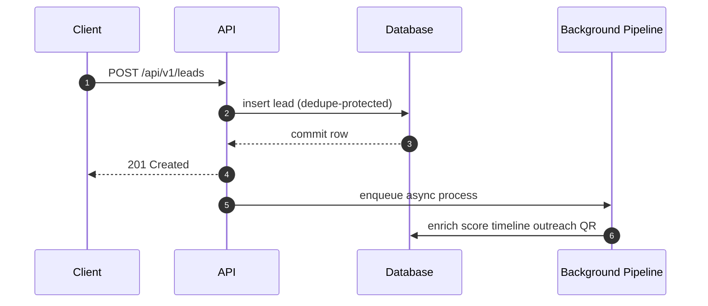
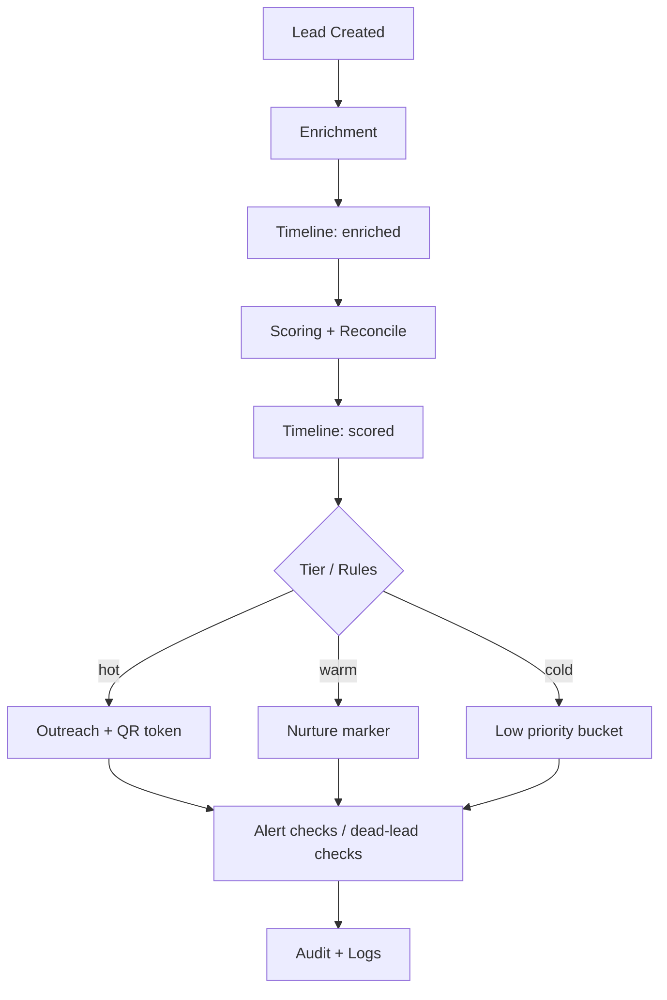
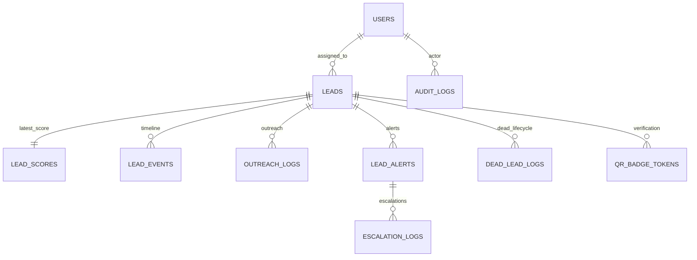
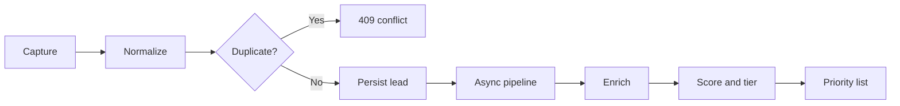
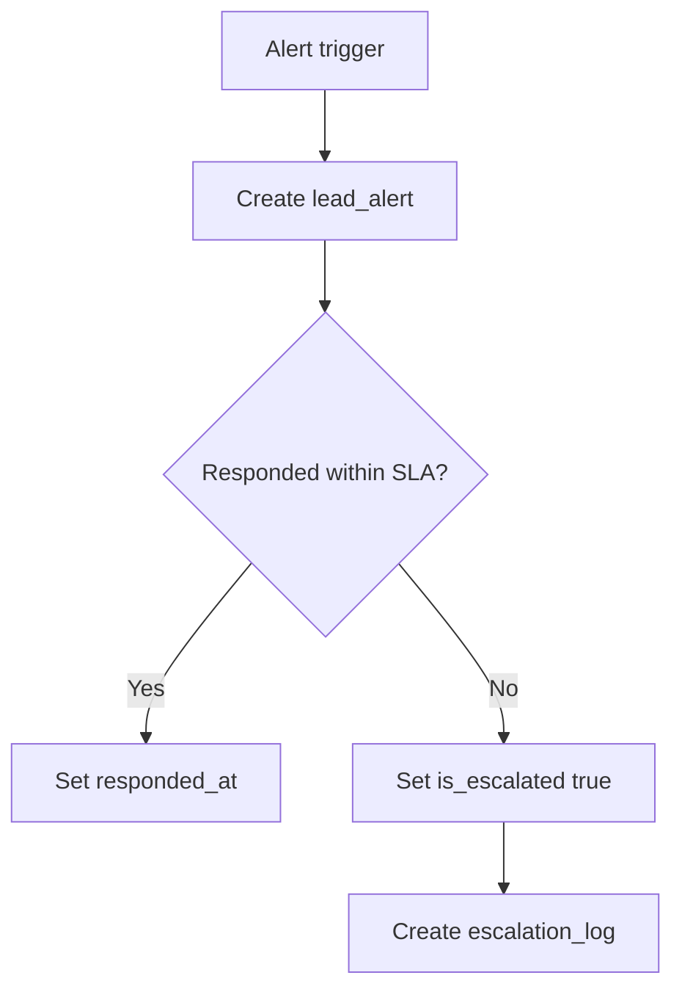
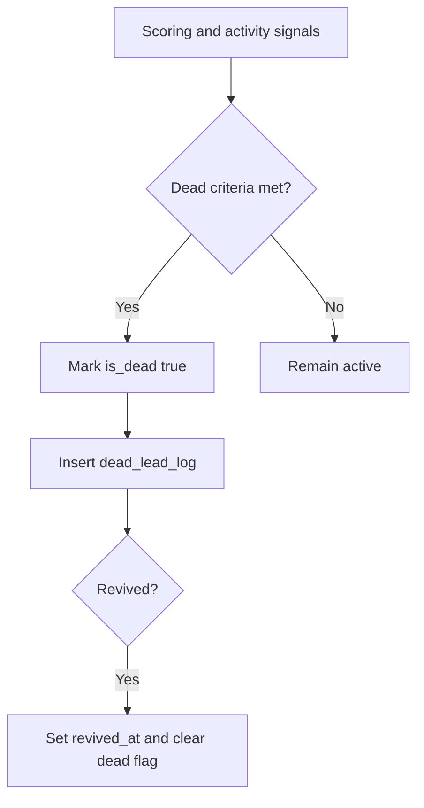
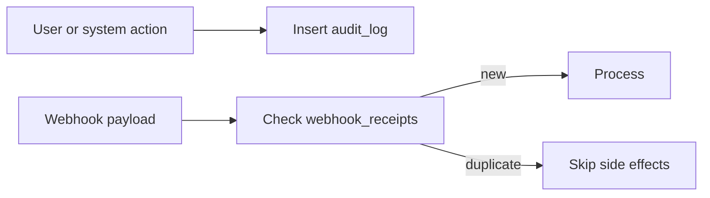
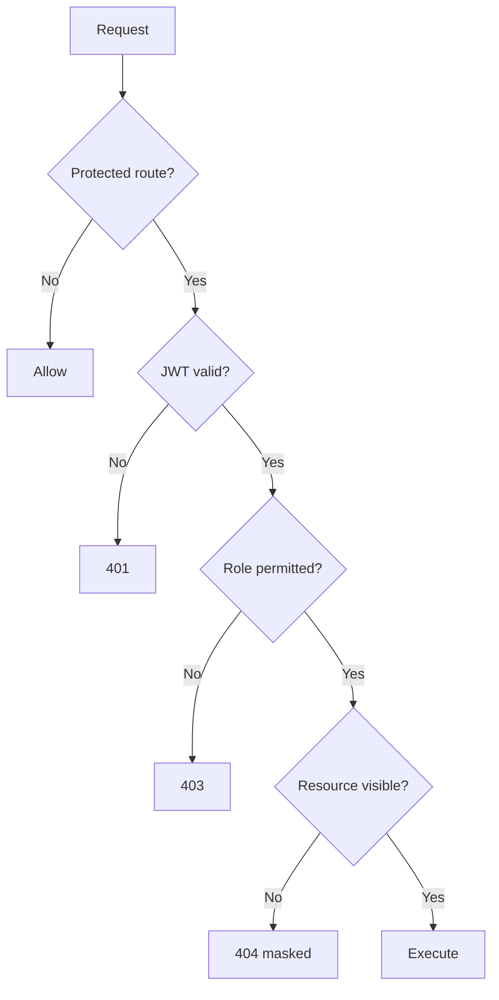

# LeadPulse Project Handbook (Comprehensive Master Document)

**Document type:** End-to-end project master document  
**Product:** LeadPulse  
**Version:** 1.1  
**Date:** 28 April 2026  
**Audience:** reviewers, developers, maintainers, deployment owners

---

## Table of Contents

1. Executive Summary  
2. Problem Statement and Context  
3. Vision, Goals, and Success Metrics  
4. Scope, Assumptions, and Constraints  
5. Stakeholders, Personas, and Role Matrix  
6. Requirements (Functional + Non-Functional)  
7. Architecture Overview  
8. Module-Level System Design  
9. Data Architecture and Database Design  
10. API Architecture and Endpoint Catalog  
11. Core Business Flows  
12. Security, Privacy, and Governance  
13. Performance, Scalability, and Reliability  
14. Testing Strategy and Quality Assurance  
15. DevOps, Deployment, and Operations  
16. Risks, Trade-offs, and Mitigation Plan  
17. Roadmap and Enhancement Plan  
18. Documentation Cross-Reference  
19. Go-Live / Submission Checklist

---

## 1. Executive Summary

LeadPulse is a full-stack B2B lead intelligence and workflow platform built to centralize lead capture, enrichment, prioritization, and response operations.

It solves a common sales-engineering gap:

- inbound lead data is fragmented and inconsistent,
- prioritization is manual and delayed,
- response SLAs are not operationally enforced,
- critical actions are not consistently auditable.

LeadPulse combines:

- unified lead ingestion (API + webhook + forms),
- explainable scoring (reasons, grade, tier),
- SLA alerts and escalation workflows,
- dead-lead lifecycle management,
- audit and idempotency safeguards.

---

## 2. Problem Statement and Context

### 2.1 Core Problem

Modern lead pipelines usually fail in one or more areas:

- **Capture fragmentation:** data from ads, forms, and automations has different shapes.
- **Data quality issues:** missing/invalid contact information causes downstream failures.
- **Slow triage:** no deterministic way to rank leads by business value.
- **Follow-up inconsistency:** teams miss response windows for high-intent leads.
- **Governance gaps:** weak action traceability and duplicate webhook side effects.

### 2.2 Why LeadPulse

LeadPulse provides one data model and one operating workflow for all lead channels.
It turns incoming signals into concrete decisions:

1. Is this lead valid and unique?
2. How valuable is this lead now?
3. Who should act, by when?
4. What happened historically, and can we prove it?

---

## 3. Vision, Goals, and Success Metrics

### 3.1 Vision

Build a practical system where every lead is:

- captured reliably,
- scored transparently,
- actioned on time,
- and auditable end-to-end.

### 3.2 Functional Goals

- Role-based authentication and authorization (`admin`, `sales`, `manager`).
- Lead ingestion through authenticated API and webhook channels.
- Pipeline: normalize -> enrich -> score -> automation.
- Dedicated score artifacts with explainable reasons.
- Operational alerts, escalations, and dead-lead lifecycle controls.
- Timeline and outreach history per lead.
- Public verification/token and tracking-support flows.

### 3.3 Non-Functional Goals

- Keep API response latency low during ingestion.
- Ensure operational safety through security defaults.
- Support maintainable schema evolution and predictable deployments.
- Provide observability hooks for debugging and governance.

### 3.4 Suggested KPI Targets

- Ingestion success rate >= 99%.
- Duplicate-lead conflict response correctness = 100% (email-based dedupe).
- P95 capture endpoint latency < 300ms (excluding async pipeline completion).
- High-priority alert response within SLA >= 90%.
- Zero duplicate side-effects for webhook idempotent retries.

---

## 4. Scope, Assumptions, and Constraints

### 4.1 In Scope

- Auth, RBAC, lead CRUD/list/filtering.
- Webhook ingestion and normalization.
- Background enrichment and scoring.
- Priority list and dead-lead workflows.
- Alerting and escalation logs.
- Audit logs, webhook receipts, and verification tokens.

### 4.2 Out of Scope

- Full enterprise CRM sync (bi-directional mapping and conflict resolution).
- Large-scale distributed queue orchestration by default.
- Full legal/compliance automation (GDPR workflow engine, DSR self-service).

### 4.3 Assumptions

- Backend and frontend are independently deployable.
- Database is PostgreSQL in production.
- External provider credentials are environment-driven.

### 4.4 Constraints

- Current system is modular monolith (not microservices).
- Background tasks are in-process unless external worker introduced.
- Historical schema may include backward-compatible legacy columns.

---

## 5. Stakeholders, Personas, and Role Matrix

### 5.1 Stakeholders

- Sales team (fast triage and outreach execution).
- Managers (SLA and escalation oversight).
- Admins (configuration, operations, analytics, governance).
- Engineering (maintainability and correctness).

### 5.2 Personas

- **Sales Representative:** wants ranked list + next action without ambiguity.
- **Sales Manager:** wants SLA compliance and clear escalation history.
- **Admin/Operator:** wants stable integrations, secure settings, and visibility.
- **Developer:** wants clear boundaries between API, services, and persistence.

### 5.3 Access Matrix (High Level)

| Capability | Admin | Manager | Sales |
|---|---|---|---|
| View all leads | Yes | Yes (policy-dependent) | No (scoped) |
| Assign leads | Yes | Yes (optional policy) | No |
| Respond to alerts | Yes | Yes | Yes |
| View analytics | Yes | Yes | Limited |
| Manage users | Yes | No | No |
| Public verify/tracking | Public route | Public route | Public route |

---

## 6. Requirements (Functional + Non-Functional)

### 6.1 Functional Requirements

| ID | Requirement |
|---|---|
| FR-1 | Users authenticate via JWT and carry role claims. |
| FR-2 | Leads can be ingested via API and webhooks with dedupe constraints. |
| FR-3 | Pipeline executes normalization, enrichment, scoring, and automation. |
| FR-4 | Scores include rationale (reasons/summary) and final priority tier. |
| FR-5 | Timeline and outreach events are queryable per lead. |
| FR-6 | SLA alerts and escalations are persisted and trackable. |
| FR-7 | Dead-lead marking/revival is logged with reasons. |
| FR-8 | Critical actions are audit logged. |
| FR-9 | Webhook idempotency prevents duplicate side-effects. |
| FR-10 | Public verification/token flows are supported safely. |

### 6.2 Non-Functional Requirements

| ID | Requirement |
|---|---|
| NFR-1 | API remains responsive under routine ingestion load. |
| NFR-2 | CORS and security headers are configurable by environment. |
| NFR-3 | Request-size and rate controls mitigate abuse. |
| NFR-4 | DB schema should evolve via migrations in production. |
| NFR-5 | Logs and health checks support operations/debugging. |
| NFR-6 | Data model supports indexed filtering and timeline retrieval. |

---

## 7. Architecture Overview

### 7.1 System Context



### 7.2 Internal Layering



### 7.3 Request Lifecycle (Capture)



---

## 8. Module-Level System Design

### 8.1 API Layer (Endpoint Domains)

- `auth`
- `users`
- `leads`
- `alerts`
- `analytics`
- `metrics`
- `webhooks`
- `meta_webhook`
- `website_forms`
- `integrations_status`
- `verify`
- `public`
- `tracking`

### 8.2 Dependency Layer

- `get_db()` session lifecycle.
- `get_current_user()` JWT decode + user fetch.
- `require_admin()` role gate for protected admin operations.

### 8.3 Service Layer (Core Components)

- `lead_capture`, `capture_normalize`, `standardize`
- `pipeline`, `async_pipeline`
- `scoring`, `dead_leads`, `alerts`
- `enrichment/service`, `enrichment/providers`
- `outreach_dispatch`, `workflows/outreach`
- `tracking/timeline`
- `integrity`, `verification`, `audit`
- `webhook_ingest`, `ad_payloads`, `metrics_service`

### 8.4 Processing Pipeline (Detailed)



### 8.5 Frontend Architecture

- Next.js App Router with authenticated shell.
- `apiFetch` client abstraction with token injection.
- Local session storage (`lp_token`, role/name keys).
- Role-aware navigation and module-level pages (overview, capture, leads, pipeline, analytics, integrations, settings).

---

## 9. Data Architecture and Database Design

### 9.1 Data Principles

- UUID PKs everywhere.
- `TIMESTAMPTZ` for all time columns.
- Append-only event/history logs where appropriate.
- JSONB only for flexible payload metadata.
- Explicit foreign key delete behavior.

### 9.2 ER Diagram (Operational Model)



### 9.3 Complete Table Catalog

| Table | Purpose | Key Fields | Key Constraints |
|---|---|---|---|
| `users` | Auth + role management | email, hashed_password, role, is_active | unique email, role check |
| `leads` | Lead source of truth | profile, source/channel, enrichment, scoring snapshot | unique email, tier check |
| `lead_scores` | Dedicated explainable score | score, grade, score_reasons | 1:1 unique lead_id FK |
| `lead_events` | Behavioral timeline | event_type, channel, payload, occurred_at | lead FK cascade |
| `outreach_logs` | Communication history | channel, subject, message, status, sent_at | channel check |
| `lead_alerts` | SLA tracking | trigger_reason, triggered_at, responded_at | lead FK cascade |
| `escalation_logs` | Escalation records | alert_id, manager_id, reason, note | lead FK cascade |
| `dead_lead_logs` | Dead/revive lifecycle | reason, marked_dead_at, revived_at | lead FK cascade |
| `audit_logs` | Governance log | actor_id, action, entity_type, metadata_json | actor FK set null |
| `webhook_receipts` | Idempotency | provider, idempotency_key, status | unique key |
| `qr_badge_tokens` | Public verification tokens | token, badge_type, expires_at | unique token |

### 9.4 Storage Strategy

- **Snapshot data:** `leads`, `lead_scores`.
- **Event log data:** `lead_events`, `outreach_logs`, `audit_logs`, `escalation_logs`, `dead_lead_logs`.
- **Control/security data:** `webhook_receipts`, `qr_badge_tokens`.

### 9.5 Indexing Strategy

- Lead filters: email/source/channel/tier/score/assignee/created_at.
- Timeline/history: `lead_id` + timestamp.
- Governance lookups: action/entity and idempotency/token keys.

### 9.6 Trigger and Time Semantics

- `set_updated_at()` trigger function updates `updated_at` on update.
- Applied on stateful tables that maintain mutable rows.

---

## 10. API Architecture and Endpoint Catalog

### 10.1 API Standards

- Base prefix: `/api/v1`.
- JSON request/response contracts.
- Bearer JWT for protected routes.
- Public endpoints explicitly isolated.

### 10.2 Endpoint Domain Map

```mermaid
flowchart TB
  V1[/api/v1]
  V1 --> AUTH[auth]
  V1 --> USERS[users]
  V1 --> LEADS[leads]
  V1 --> ALERTS[alerts]
  V1 --> ANALYTICS[analytics]
  V1 --> METRICS[metrics]
  V1 --> WEBHOOKS[webhooks meta website_forms]
  V1 --> PUBLIC[public verify tracking]
  V1 --> INTEG[integrations_status]
```

### 10.3 Representative Contracts

- `POST /auth/login`: returns JWT + role context.
- `POST /leads`: creates lead, enqueues async pipeline, returns lead payload.
- `GET /leads`: supports filtering/sorting constraints.
- `PATCH /leads/{id}/assign`: privileged assignment action.
- `POST /leads/{id}/events`: appends timeline signal and may trigger score recompute.
- `GET /alerts/active`, `POST /alerts/{id}/respond`: SLA loop.
- `POST /webhooks/...`: external ingestion with secret/idempotency controls.

### 10.4 Error Semantics

- 401 for authentication failures.
- 403 for authorization failures.
- 404 for non-visible resources (anti-enumeration behavior).
- 409 for duplicate lead conflicts.
- 422 for payload validation issues.

---

## 11. Core Business Flows

### 11.1 Lead Capture -> Qualification



### 11.2 SLA Alert -> Escalation



### 11.3 Dead-Lead Lifecycle



### 11.4 Governance Flow



---

## 12. Security, Privacy, and Governance

### 12.1 Authentication and Authorization

- JWT verification on protected routes.
- Role checks for admin/privileged actions.
- Scoped lead visibility for non-admin roles.



### 12.2 API Hardening

- Request body size limits.
- Per-IP rate limiting.
- Security headers (CSP/frame/HSTS policy toggles).
- CORS controlled by environment settings.

### 12.3 Data Security and Privacy

- PII fields constrained to required business operations.
- Passwords stored as hashes, never plaintext.
- Secrets managed via environment variables.
- Public verification uses opaque tokens, not raw identifiers.

### 12.4 Governance Controls

- Action-level audit trails.
- Webhook dedupe by idempotency key.
- Integrity hashes for capture payload consistency.

---

## 13. Performance, Scalability, and Reliability

### 13.1 Current Characteristics

- Fast ingestion response by deferring heavy work.
- Indexed relational access for common lead and timeline queries.
- Operationally simple modular monolith architecture.

### 13.2 Scalability Path

1. Move in-process background tasks to queue workers.
2. Add caching for expensive aggregations.
3. Partition/archive large event tables by time windows.
4. Add query observability and slow query tuning.

### 13.3 Reliability Controls

- Health checks for API process.
- Idempotent webhook behavior.
- Explicit schema migrations for production.
- Alert escalation logic for response failures.

---

## 14. Testing Strategy and Quality Assurance

### 14.1 Testing Levels

- Unit tests (normalization/scoring/hash logic).
- Integration tests (API + DB behavior).
- System tests (manual or automated E2E).
- Static analysis (`lint`, build checks).

### 14.2 Requirement Traceability

| Requirement Area | Test Focus |
|---|---|
| Auth/RBAC | login success/failure, role denial |
| Capture/Dedupe | valid creation, duplicate conflict |
| Pipeline | enrichment + score + timeline |
| Alerts/Escalation | SLA transitions and log creation |
| Governance | audit rows + idempotency behavior |

### 14.3 Baseline Reality

- Current repo emphasis is manual and lint verification.
- Automated test expansion is a high-priority next step.

### 14.4 QA Expansion Plan

1. Add backend `pytest` harness.
2. Add API contract tests for critical endpoints.
3. Add smoke E2E for login/capture/list workflow.
4. Add CI gates for tests + lint + build + security checks.

---

## 15. DevOps, Deployment, and Operations

### 15.1 Deployment Topology

- Frontend and backend deployed independently.
- Production DB on Render PostgreSQL.
- Environment-specific config through secrets/vars.

### 15.2 Environment Configuration Categories

- Core: `DATABASE_URL`, JWT settings, API prefix.
- Security: CORS, webhook secrets, rate limits, HSTS toggles.
- Integrations: enrichment and outreach provider keys.
- Feature behavior: scoring thresholds, synthetic engagement toggle.

### 15.3 Migration and Release Discipline

- Use migration scripts for schema changes.
- Run schema validation and smoke checks pre-release.
- Back up DB before destructive migrations.

### 15.4 Runbook (Minimal)

1. Confirm env vars and DB connectivity.
2. Apply DB migration scripts.
3. Start backend and run health check.
4. Start frontend and verify auth/capture flow.
5. Verify critical endpoints and logs.

---

## 16. Risks, Trade-offs, and Mitigation Plan

| Risk | Impact | Mitigation |
|---|---|---|
| In-process background task loss | Missed pipeline completion | Queue workers and retries |
| Weak test automation baseline | Regression risk | CI-backed integration tests |
| Token storage in localStorage | XSS exposure risk | CSP hardening and cookie-session roadmap |
| Schema drift with evolving models | Runtime mismatches | migration-first discipline |
| Noisy external webhook payloads | bad data and duplicates | strict normalize/validate + idempotency |

### Key Trade-offs

- Monolith speed of delivery vs. future service decomposition flexibility.
- Simple async model now vs. durable job orchestration later.
- Rich lead snapshot convenience vs. potential denormalization overhead.

---

## 17. Roadmap and Enhancement Plan

### Phase 1 (Quality Hardening)

- Full API integration suite.
- Alert/escalation SLA analytics dashboard.
- Strong schema drift checks in CI.

### Phase 2 (Scalability)

- Worker queue for pipeline tasks.
- Cached analytics endpoints.
- Event table archival policy.

### Phase 3 (Product Expansion)

- CRM connectors.
- Adaptive assignment strategy.
- Improved model explainability artifacts.

---

## 18. Documentation Cross-Reference

- `docs/01-Design-LeadPulse.md` - deep architecture and design decisions.
- `docs/02-Implementation-LeadPulse.md` - code-level realization and module mapping.
- `docs/03-Testing-LeadPulse.md` - test strategy, cases, and current evidence.
- `docs/04-Tools-and-Technologies-LeadPulse.md` - stack rationale.
- `docs/05-Conclusion-LeadPulse.md` - outcome summary.
- `docs/06-Appendices-LeadPulse.md` - glossary and quick references.
- `docs/08-Enhancement-Improvement-Log.md` - change and hardening history.

---

## 19. Go-Live / Submission Checklist

- Problem statement and scope validated.
- Requirements and traceability documented.
- Architecture and module-level design documented.
- Database model and operational flows documented.
- API domains and core contracts documented.
- Security and governance controls documented.
- Testing status and QA plan documented.
- Deployment and runbook documented.
- Risks and roadmap documented.

---

**End of LeadPulse Comprehensive Project Handbook**
